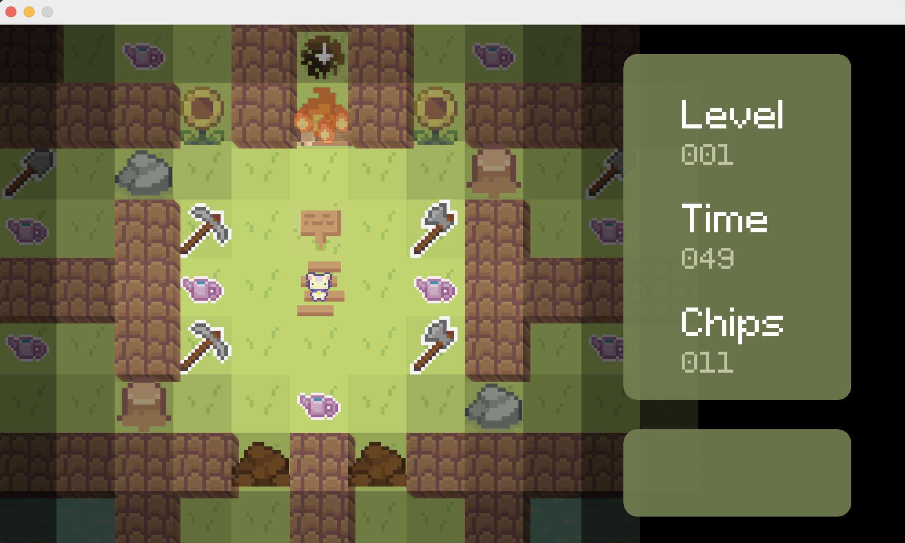
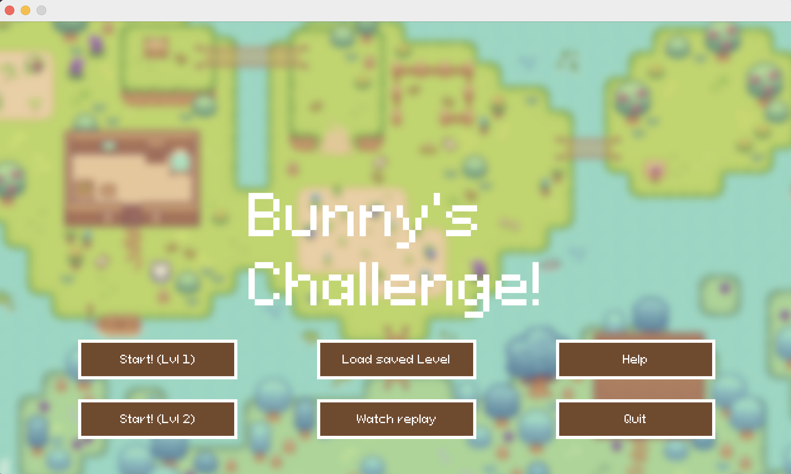

# Chips-Challenge

Group Project for SWEN225 - recreating the famous Chips Challenge game

Chips challenge is a famous tile based puzzle game. The requirments from this project was to develop our own Chips Challenge.

# How to run
Start the game by running nz.ac.vuw.ecs.swen225.gp22.app.Main from Eclipse.

The application will open to this screen:

# My own components
For this project I was in charge of the app parts. My responsibilities included create the GUI for the game, saving game states, loading game states, help Menu and keyboard accessibility.

# My classes
My class are found in the app folder, and include - 
Chips - Create the game and the different GUI and load different parts of game
Controller - for player movement within game
CustomButton - custom button for GUI design
Keys - for player movement within game
Main - starts game and calls Chips class
